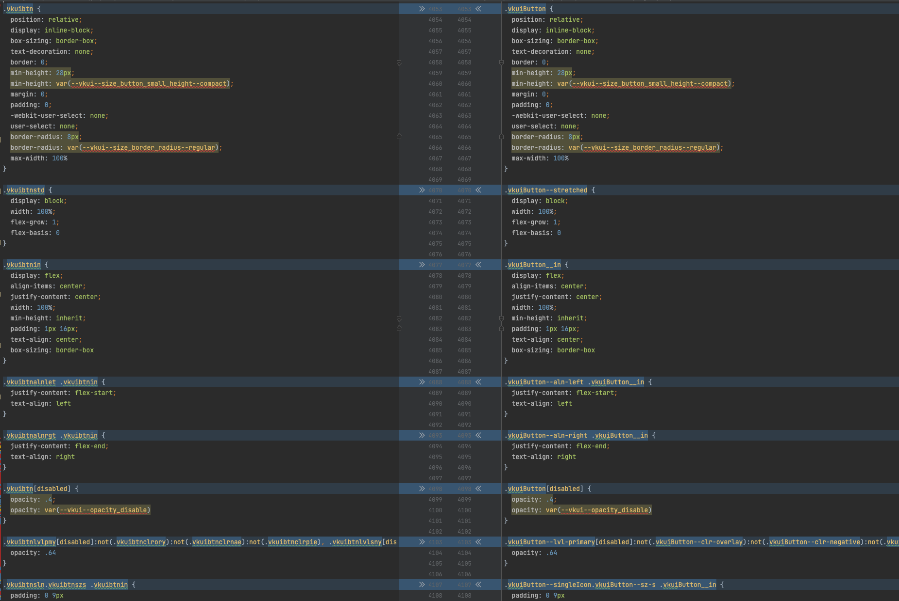

# Сокращение CSS классов

Во всех трёх вариантах удалены только лишние компоненты. Остальное старался не трогать.

Тестировалось с этими компонентами:

- `AdaptivityProvider`
- `AppearanceProvider`
- `AppRoot`
- `Button`
- `ButtonGroup`
- `ConfigProvider`
- `Div`
- `FocusVisible`
- `LocaleProviderContext`
- `Spinner`
- `Tappable`
- `Touch`
- `Typography`

> Note: если что `styleguide` запускаться не будет, т.к. удалены компоненты, которые он использует внутри.

- [original](./original) – собственно кроме удаления лишних компонентов, изменений нет.
- [css-modules-with-hash](./css-modules-with-hash) – импортируем CSS селекторы в JS (подробнее тут https://github.com/VKCOM/VKUI/pull/2294).

> ❌️ [css-with-hash](./css-with-hash) – попытка прикрутить [babel-plugin-react-css-modules](https://github.com/gajus/babel-plugin-react-css-modules),
  как один способов ухода от `vkuiClass`. Оставил чисто как пример. Сокращение CSS классов не отличается от той,
  что в [css-modules-with-hash](./css-modules-with-hash). Поэтому далее в метриках упоминать не буду. 

## Метрики

Запускал `yarn size`. 

### [original](./original)

```
JS
Size: 12.89 kB with all dependencies, minified and gzipped

CSS
Size: 18.59 kB with all dependencies, minified and gzipped
```

### [css-modules-with-hash](./css-modules-with-hash)

#### JS:
```
Size: 13.9 kB with all dependencies, minified and gzipped
````

Отдельно отмечу вес JS после удаления `jsxRuntinme` (**не коммитил**):
```
Size: 13.9 kB with all dependencies, minified and gzipped
```

#### CSS

Для того чтобы алгоритм DEFLATE, используемый в gzip, сжимал файл максимально эффективно, необходимо сокращать классы, 
а не создавать уникальные (имеется ввиду `[hash:base64:5]` в конфиге CSS Modules). При последнем, мы теряем преимущества алгоритма LZ77 (внутри DEFLATE),
который создаёт ссылки на повторяющиеся строки.

В [generateScopedName](https://github.com/madyankin/postcss-modules#generating-scoped-names) набросал функцию, которая
сокращает названия BEM классов. Блок, элемент и модификатор
сокращается до 3-х символов, а `__`, `--` и `-` удаляются. Функцию можно найти здесь [./css-modules-with-hash/constants.js](./css-modules-with-hash/constants.js)
(она шарится между `babel` и `postcss` конфигами).



**Pис. 1.** Разница между сокращенными и не сокращенными классами.

1. С префиксом `vkui`
    ```
    Size: 18.4 kB with all dependencies, minified and gzipped
    ```
    Разница в `0.19 kB`.
2. Без префикса `vkui`
    ```
    Size: 18.38 kB with all dependencies, minified and gzipped
    ```
    Разница в `0.21 kB`.

### [VKUI](https://github.com/VKCOM/VKUI)

> Версия `v4.29.0`

> ⚠️ Прогонял только CSS. Конечно же, вёрстка при запуске поедет, т.к. в JS классы не обрабатываются

**До** сокращения классов
```
CSS
Size: 43.48 kB with all dependencies, minified and gzipped
```

**После**
1. С префиксом `vkui`
    ```
    Size: 41.38 kB with all dependencies, minified and gzipped
    ```
   Разница в `2.1 kB`.
2. Без префикса `vkui`
    ```
    Size: 41.01 kB with all dependencies, minified and gzipped
    ```
   Разница в `2.47 kB`.

## Результат

Вес бандла уменьшается на `~5%`.

## Внедрение

### `CSS Modules`

Прост в реализации (подробнее опять же тут https://github.com/VKCOM/VKUI/pull/2294).

Если вкратце необходимо все компоненты привести к виду

 ```jsx
 import styles from './Cmp.css'
 const Cmp = () => <div className={styles.Cmp} />
 ```

Затем, для уменьшения JS бандла, нужно найти/написать babel плагин, который сможет траспайлить всё это в

```jsx
const Cmp = () => <div className="vkuicmp" />
```

А то сейчас вот так транспайлится

```jsx
const styles = { Cmp: "vkuicmp" };
const Cmp = () => <div className={styles.Cmp} />
```

из-за чего получается, что уменьшая размер CSS мы увеличиваем размер JS бандла.

### CSS-in-JS

Совершенно иной подход, который требует отдельного изучения. Сейчас есть масса инструментов:
- [goober](https://github.com/cristianbote/goober)
- [emotion](https://github.com/emotion-js/emotion)
- и т.п.