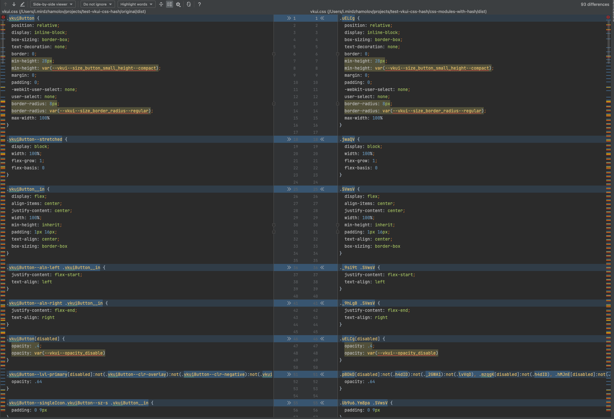

# Хэширование CSS

Во всех трёх вариантах удалены только лишние компоненты. Остальное старался не трогать.

Тестировалось с этими компонентами:

- `AdaptivityProvider`
- `AppearanceProvider`
- `AppRoot`
- `Button`
- `ButtonGroup`
- `ConfigProvider`
- `Div`
- `FocusVisible`
- `LocaleProviderContext`
- `Spinner`
- `Tappable`
- `Touch`
- `Typography`

> Note: если что `styleguide` запускаться не будет, т.к. удалены компоненты, которые он использует внутри.

- [original](./original) – собственно кроме удаления лишних компонентов, изменений нет.
- [css-modules-with-hash](./css-modules-with-hash) – импортируем CSS селекторы в JS (подробнее тут https://github.com/VKCOM/VKUI/pull/2294).
- ❌️ [css-with-hash](./css-with-hash) – попытка прикрутить [babel-plugin-react-css-modules](https://github.com/gajus/babel-plugin-react-css-modules),
  как один способов ухода от `vkuiClass`. Оставил чисто как пример. Хэширование CSS не отличается от той,
  что в [css-modules-with-hash](./css-modules-with-hash). Поэтому далее в метриках упоминать не буду. 

## Метрики

Запускал `yarn size`. 

### [original](./original)

```
JS
Size: 12.89 kB with all dependencies, minified and gzipped

CSS
Size: 18.59 kB with all dependencies, minified and gzipped
```

### [css-modules-with-hash](./css-modules-with-hash)

#### JS:
```
Size: 14.15 kB with all dependencies, minified and gzipped
````

Отдельно отмечу вес JS после удаления `jsxRuntinme` (**не коммитил**):
```
Size: 13.9 kB with all dependencies, minified and gzipped
```

#### CSS

Игрался с [generateScopedName](https://github.com/madyankin/postcss-modules#generating-scoped-names).
Нужно менять в `babel` и `postcss` конфигах, поэтому для удобства вынес сюда [constants.js](./constants.js).

1. `"[hash:base64:5]"`
    ```
    Size: 18.66 kB with all dependencies, minified and gzipped
    ```
    Как мы видим, несмотря на то, что классы значительно сократились, вес стал даже больше.

2. `"[hash:base64:4]"`
    ```
    Size: 18.54 kB with all dependencies, minified and gzipped
    ```
    Стало лучше. Правда чем меньше число, тем выше будет вероятность коллизий, если говорить о том,
    что проект, который подключает VKUI, тоже будет хэшировать классы. Можно уменьшить генерируемое значение,
    но при этом добавлять префикс `vkui`.
3. `"vkui[hash:base64:3]"`
    ```
    Size: 18.43 kB with all dependencies, minified and gzipped
    ```

---

По итогу можно сэкономить `0.16 kB`.

## Примечание

### Стили только `Button`

Оставил стили только `Button` и хэшировал через `"[hash:base64:5]"`.



> Справедливости ради отмечу, что я вручную изменил `vkui.css`.  
> Перед запуском `size-limit`, прогнал оба файла через https://www.toptal.com/developers/cssminifier/.

Без хэширования
```
Size: 1.94 kB with all dependencies, minified and gzipped
```

С хэшированием
```
Size: 1.89 kB with all dependencies, minified and gzipped
```

Здесь хэшированный выигрывает, в отличие от примера, где мы сравнивали хэширования всего пакета (см. выше **Метрики** -> **css-modules-with-hash** -> **CSS** -> **п.1**).

### Стили всего проекта VKUI

> Версия `v4.29.0`

> ⚠️ Прогонял только CSS. Конечно же, вёрстка при запуске поедет, т.к. в JS классы не обрабатываются

До хэширования
```
CSS
Size: 43.48 kB with all dependencies, minified and gzipped
```

1. `"[hash:base64:5]"`
    ```
    CSS
    Size: 42.77 kB with all dependencies, minified and gzipped
    ```
    разница в `0.71 kB`
2. `"[hash:base64:4]"`
    ```
    CSS
    Size: 41.71 kB with all dependencies, minified and gzipped
    ```
    разница в `1.77 kB`
3. `"vkui[hash:base64:3]"`
    ```
    CSS
    Size: 41.04 kB with all dependencies, minified and gzipped
    ```
    разница в `2.44 kB`